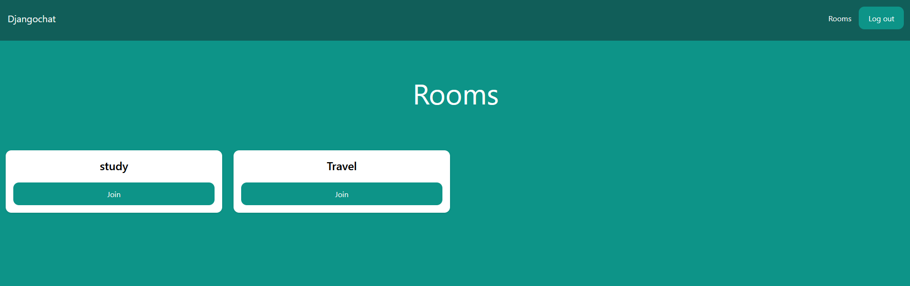
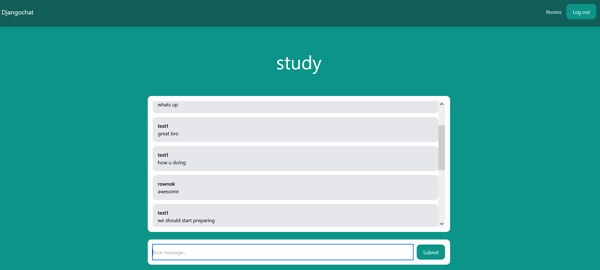

# Installation

- 1 - create a virtual environment and activate
- 2 - pip install virtualenv
- - virtualenv envname
- - envname\scripts\activate
- 3 - cd into project
- 4 - pip install -r requirements.txt
- 5 - python manage.py runserver

# Features

- Authenticaiton
- Chat Real time

# Tech Stack

- Django
- Channels

# Room Page

# Chat Page

